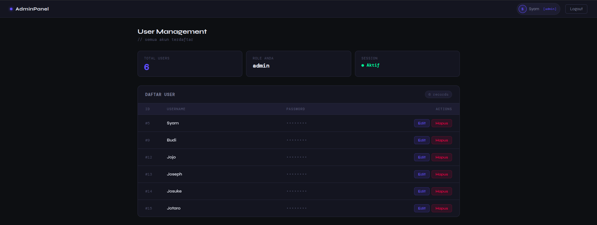

# Login System dengan PHP + MySQL

Simple Login System menggunakan PHP Native dengan konsep MVC, MySQL, Session, dan Prepared Statement.
Project ini dibuat untuk belajar backend fundamental sebelum masuk ke framework seperti Laravel.
---

## Konsep yang Dipelajari

* MVC Pattern
* Routing sederhana
* Session-based authentication
* Middleware protection
* Database interaction
* Secure password handling
* Separation of concerns
* CSRF Protection
* Role based access
* Flash messages
* Validation Layer
---

## Features

- Register user
- Login system
- Logout system
- Session authentication
- Middleware auth (protected route)
- MVC architecture
- Prepared statements (anti SQL injection)
- Password hashing (password_hash & password_verify)
- Dashboard user listing
- CSRF Token
- Role Admin/User
- Validation Layer
- Flash Messages

---

## Tech Stack

- PHP 
- MySQL

---

## Default Routes

| Page      | URL                  |
| --------- | -------------------- |
| Login     | `/?action=login`     |
| Register  | `/?action=register`  |
| Logout    | `/?action=logout`    |

---

## Authentication Flow

```
Login → Session dibuat → Akses Dashboard → Middleware check → Logout destroy session
```
---

## Struktur Folder
```
project/
│
├── app/
│   ├── controllers/
│   │   ├── AuthController.php
│   │   └── DashboardController.php
│   │
│   ├── models/
│   │   └── User.php
│   │
│   ├── views/
│   │   ├── auth/
│   │   │  ├── login.php
│   │   │  └── register.php
│   │   ├── dashboard.php
│   │   └── edit.php
│   │    
│   ├── middleware/
│       ├── AuthMiddleware.php
│       └── AdminMiddleware.php
├── core/
│   ├── Database.php
│   └── CSRF.php
│
├── public/
│   └── index.php
│
```
---

## Setup 

### Database `sql`
```sql
CREATE TABLE Users (
    id INT AUTO_INCREMENT PRIMARY KEY,
    username VARCHAR(100) NOT NULL,
    password VARCHAR(255) NOT NULL,
    role VARCHAR(25) NOT NULL DEFAULT 'user'
)
-- Set salah satu user menjadi admin!
UPDATE Users
SET role = 'admin'
WHERE id = 1;
```
### `core/Database.php`
```php
class Database {
    private $host = "";
    private $nama = "";
    private $password = "";
    private $nama_db = "";

    public $koneksi;

    public function __construct()
    {
        $this->koneksi = mysqli_connect(
            $this->host,
            $this->nama,
            $this->password,
            $this->nama_db
        );
        if (!$this->koneksi) {
            die("Koneksi gagal");
        }
    }
}
```
---

## Notes
    
* Project ini masih versi belajar (belum production ready)

---

## Future Improvements?

---

## View




### Note for me
Frontendnya full AI otw belajar Typescript
